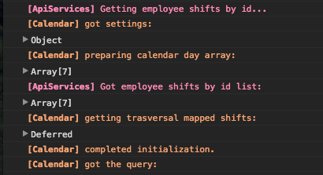
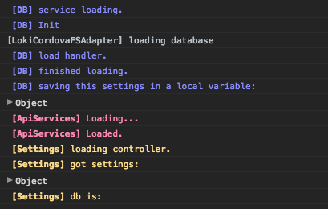
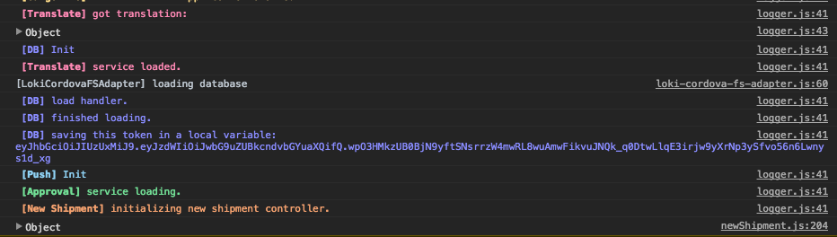

# Just another logger
A color coded, session oriented, javascript logger for your project.  

`Hey Ed, why did you make another logger?`  

Because this thing is outputing messages with different colors *automagically*,
grouping them by section.
You don't have to think about colors, it will do it **by itself**.  
Each section has a different `color`, so when you see
 pink colored output you know that a `love` section something has been logged. Get it?  

Here are some code lines:

`log.debug( "ApiService" , "Getting employee shifts by id...");`  
`log.debug( "Calendar" , "got settings", settings);`  

... that will get you:

  

  

  

Wanna use it?

`npm install justanotherlogger`  

Then load it somehow, like in a html page:

``  

And bam, use it:

`log.debug( "Session Name", "comment" , optional_object_to_show);`  
`log.error( "Session Name", "sad comment" , optional_error_to_show);`

## What a colorful joy to look at those logs...
